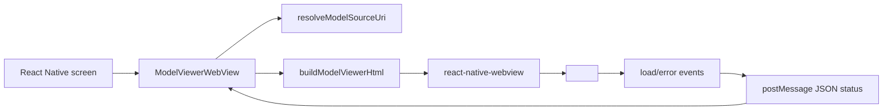

# How It Works

`react-native-model-viewer-webview` is a small adapter around three pieces:

1. React Native renders a `react-native-webview` instance.
2. The package generates a complete HTML document containing Google's
   `<model-viewer>` web component.
3. The WebView sends structured status messages back to React Native through
   `window.ReactNativeWebView.postMessage`.

It does not implement a renderer. The renderer is the platform WebView running
`<model-viewer>`.

## Architecture



## Why WebView

Native 3D stacks are better when 3D is the product. This package exists for the
opposite case: 3D is a preview inside a normal app screen.

Using WebView gives us:

- the same high-level `<model-viewer>` API used on the web
- simple camera controls and auto-rotate
- GLB/glTF support delegated to a maintained web component
- a small React Native API surface
- compatibility with Expo and bare React Native apps that already support
  `react-native-webview`

It also means:

- startup cost is higher than a native view
- WebView memory matters in long lists
- WebView gesture behavior may need screen-level tuning
- rendering quality and bugs depend on the platform WebView

## Source Resolution

`resolveModelSourceUri` accepts:

- string URLs, including `https:`, `data:`, and `file:`
- React Native static asset module numbers from `require(...)`
- asset-like objects with `localUri` and/or `uri`

For objects, `localUri` wins over `uri` because local files are preferred after
an Expo asset has been downloaded.

For module numbers, the package calls `Image.resolveAssetSource`. React Native
does not have a dedicated generic asset resolver with equivalent availability,
so `Image.resolveAssetSource` is used as the practical stable option.

## HTML Generation

`buildModelViewerHtml` creates a full HTML document with:

- viewport metadata
- a `<model-viewer>` script tag
- WebView status bridge helpers
- a full-size `<model-viewer>` element
- generated model-viewer attributes

Attribute values are HTML-escaped. Attribute names must match a conservative
safe-name pattern before they are emitted. Basic CSS color values are sanitized
to avoid injecting arbitrary CSS into generated HTML.

## Script Loading

By default, the HTML inlines the vendored runtime:

```text
@google/model-viewer 4.2.0
```

This avoids a CDN request at runtime, so a bundled/local model asset can render
without network access. It also makes each package version deterministic: the
same npm package version always embeds the same `<model-viewer>` runtime.

The vendored runtime is generated into `vendor/model-viewer/runtime.js` from
`@google/model-viewer`'s `dist/model-viewer.min.js`. Source hashes and license
metadata are recorded in `vendor/model-viewer/SOURCE.md`.

Apps that want to use a different runtime can provide either:

- `modelViewerScriptUrl`, such as a CDN URL or `file:` URL to another script
- `modelViewerScript`, an inline module script string

Inline script content escapes closing `</script>` sequences to avoid breaking
the generated document.

## Event Flow

The generated HTML posts JSON messages:

```json
{ "type": "dom-ready", "message": "Model viewer DOM ready" }
```

Important event types:

- `dom-ready`
- `model-loaded`
- `model-error`
- `page-error`

`ModelViewerWebView` parses these messages and exposes:

- `onStatus` for every status
- `onModelLoaded` for `model-loaded`
- `onModelError` for statuses ending in `error`

Raw or malformed WebView messages are converted into `page-error` statuses.

## What This Package Does Not Do

- It does not implement native rendering.
- It does not expose a scene graph.
- It does not manage physics, shaders, or multiple model scenes.
- It does not guarantee AR support.
- It does not guarantee identical rendering across Android and iOS WebViews.

Those are native renderer concerns. Use Filament, React Three Fiber Native, or
Expo GLView for those workloads.
